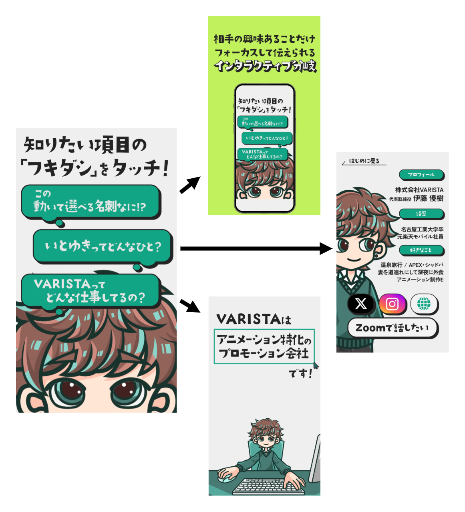
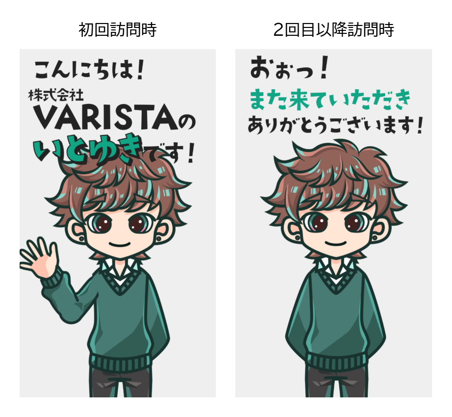
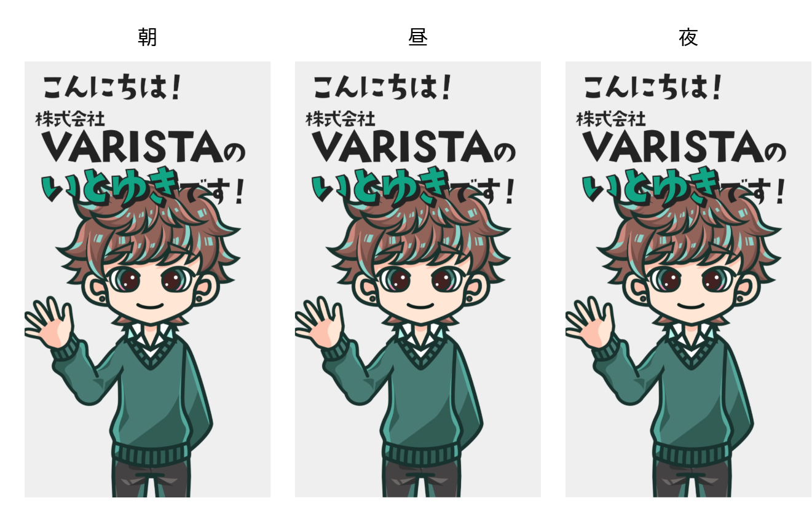
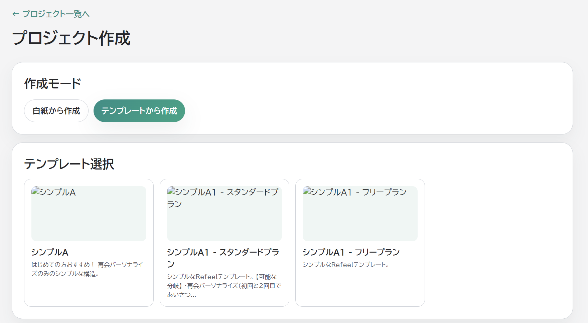
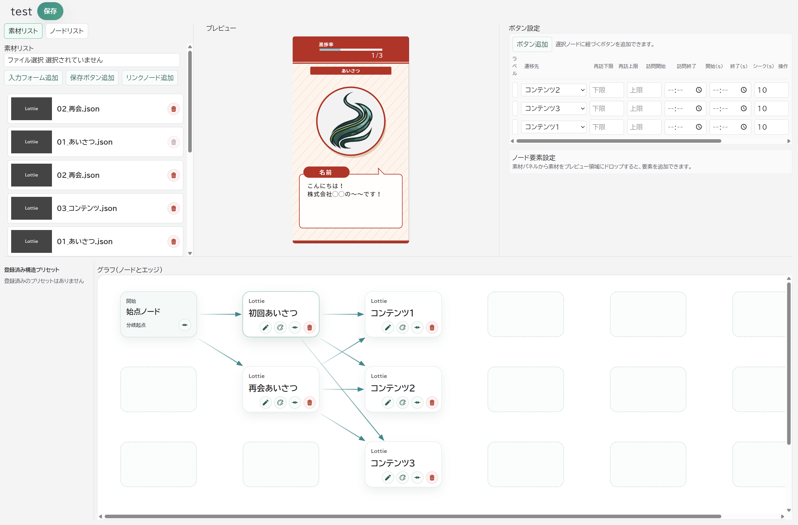
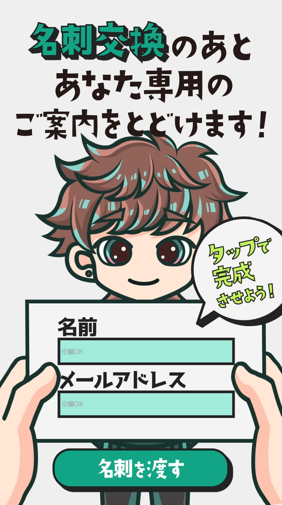
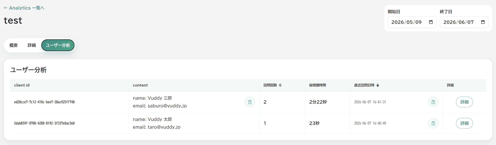

# Vuddyサービス資料

## 概要

Vuddyは、動画内にボタン、選択肢、入力フォーム、外部リンクを配置し、視聴者の操作や訪問回数、訪問時刻に応じて表示する動画や情報を切り替えられるインタラクティブ動画の作成・配信・分析サービスです。

制作者は、テンプレートを利用してWeb上で動画の分岐や導線を設定し、完成したコンテンツをURLで公開・共有できます。視聴者は、自分が知りたい情報を選択しながら動画を視聴し、動画内から問い合わせ、予約、商談申込み、フォーム回答などの次の行動へ進めます。

公開後は、視聴数や視聴完了率、選択肢ごとの遷移率、離脱ポイント、入力フォームの回答内容を確認できます。採用活動における会社紹介、営業時の商品説明、教育・研修コンテンツなど、視聴者ごとに異なる情報を届けたい場面で利用できます。

## 各種機能

### 視聴

#### ボタン分岐

動画上に表示されたボタンを押下することで、次の動画へ自動的に遷移します。



#### 訪問回数分岐

訪れた回数に応じて表示内容が変化します。



#### 訪問時刻分岐

訪れた日時に応じて表示内容を変化します。



### 編集

#### テンプレ機能

あらかじめVuddyで用意されているテンプレートを使用して、動画の内容を簡単に編集できます。

##### テンプレートを選択



##### 指定したテンプレートを編集してVuddyを作成



#### 入力フォーム設置

動画中に入力フォームを設置し、視聴者の入力を収集することができます。

##### 入力フォームをVuddyに設定



##### 視聴者からの入力を収集・分析



#### ボタン分岐設定

動画上に表示されたボタンを押下することで、次の動画へ自動的に遷移するための設定を行います。


#### 訪問回数分岐設定

訪れた回数に応じて表示内容を変化するための設定を行います。


#### 訪問時刻分岐設定

訪れた日時に応じて表示内容を変化するための設定を行います。


### 分析

#### 選択肢遷移率

動画中の選択肢を押下した際の遷移率を分析するためのデータを表示します。


#### 視聴完了率

視聴者が動画を完了した割合を分析するためのデータを表示します。


#### 離脱ポイント

視聴者が動画を離脱したポイントを分析するためのデータを表示します。


#### エンゲージメントグラフ

視聴者のエンゲージメントを分析するためのグラフを表示します。


#### 入力フォーム収集

視聴者からの入力フォームの収集データを表示します。


## ユースケース

### 採用活動

#### ペルソナ例

##### 導入企業・担当者

従業員200名のSaaS企業で働く採用マネージャー。

中途エンジニアを年間20名採用したいが、候補者への会社説明を繰り返す負担が大きい。採用サイトだけでは、開発環境や社員の雰囲気が伝わらず、面談前の辞退も発生している。

##### 求職者

29歳のWebエンジニア。現在は情報収集段階で、積極的に応募するほど転職意欲は高くない。

技術スタック、リモート勤務の実態、開発チームの雰囲気を知りたい。長い会社紹介動画は見ないが、興味のある情報だけなら通勤中に確認したい。

#### Vuddyの利用シナリオ例

1. スカウトメールや採用サイトにVuddyのURLを掲載する
2. 求職者が「仕事内容」「社員の雰囲気」「働き方」から知りたい内容を選択する
3. 選択内容に応じて、社員インタビューや職場紹介動画を表示する
4. 動画内からカジュアル面談を予約できるようにする
5. 再訪時には、前回の視聴内容に応じてFAQや選考フローを案内する
6. 採用担当者は、選択率・離脱ポイント・面談予約率を分析して内容を改善する

#### 導入前/利用体験/導入後

##### 導入前

一律の会社紹介では候補者の関心に応えられない

##### 利用体験

候補者が選択する動画分岐

##### 導入後

面談予約、応募、採用ミスマッチの改善

#### KPI例

視聴完了率、面談予約率、応募率、選考辞退率

#### 採用活動としてのVuddy活用例

<iframe
  src="https://app.refeel.m-varista.com/watch/itoyuki"
  title="採用活動向けインタラクティブ動画"
  allowfullscreen
>
</iframe>

### 営業

#### ペルソナ例

##### 導入企業・教育担当者

従業員500名の小売企業で働く人材開発担当者。

新入社員向けに接客マナーや商品知識の研修を行っているが、集合研修だけでは理解度にばらつきが出ている。受講者がどこでつまずいたのか把握しづらく、研修後のフォローも属人的になっている。

##### 見込み顧客

入社1年目の店舗スタッフ。

接客の基本は理解しているが、クレーム対応や商品説明にはまだ不安がある。長い研修動画を一方的に見るより、自分が苦手な場面を選んで確認したい。実際の接客シーンに近い動画で学びたい。

#### Vuddyの利用シナリオ例

1. 研修担当者が、接客・商品知識・クレーム対応などのテーマ別動画を用意する
2. 受講者が「基本を学ぶ」「事例を見る」「確認テストを受ける」などを選択する
3. 理解度や職種に応じて、表示する動画や解説を分岐させる
4. 動画内フォームで理解度チェックや質問を回収する
5. 再訪時には、前回の視聴状況に応じて復習コンテンツを表示する
6. 教育担当者が視聴完了率、離脱ポイント、回答内容を分析し、教材を改善する

#### 導入前/利用体験/導入後

##### 導入前

一律の研修動画では、受講者ごとの理解度やつまずきが分からない

##### 利用体験

顧客自身が知りたい情報を選択する

##### 導入後

研修の定着率向上、フォロー工数削減、教材改善

#### KPI例

視聴完了率、確認テスト回答率、理解度スコア、再視聴率、研修後の実務定着率

#### Vuddy構成例
```
学習したい内容を選択してください
├─ 基本ルールを学ぶ
├─ 実務シーンを見る
└─ よくあるミスを確認する

理解度を選択してください
├─ よく理解できた
├─ もう一度確認したい
└─ 質問したい

次の行動を選択してください
├─ 確認テストに進む
├─ 関連教材を見る
└─ 担当者に質問を送る
```

#### 営業としてのVuddy活用例

<iframe
  src="https://app.refeel.m-varista.com/watch/itoyuki"
  title="営業向けインタラクティブ動画"
  allowfullscreen
>
</iframe>

### 教育コンテンツ

#### ペルソナ例

##### 導入企業・営業担当者

従業員150名の業務管理SaaS企業で働く法人営業担当者。

月に約50件の見込み顧客を担当している。顧客によって関心事項が異なるため、初回商談で基本機能から説明することに時間がかかっている。商談前に顧客の関心や検討状況を把握し、提案内容を最適化したい。

##### 見込み顧客

従業員300名の製造業で働く、情報システム部門の課長。

社内の業務管理がExcel中心で、情報共有や集計作業に課題を感じている。複数サービスを比較しており、機能だけでなく導入工数、セキュリティ、類似企業の導入事例を確認したい。

#### Vuddyの利用シナリオ例

1. 営業メール、展示会後のフォロー、サービスサイトでVuddyのURLを案内する
2. 見込み顧客が、自社の状況や知りたい情報を選択する
3. 選択内容に応じて、適切な商品説明や導入事例を表示する
4. 動画内から資料請求、問い合わせ、デモ予約へ誘導する
5. 営業担当者が視聴内容を確認し、関心事項に合わせて商談を行う
6. 選択率や離脱ポイントを分析し、営業コンテンツを改善する

#### 導入前/利用体験/導入後

##### 導入前

すべての顧客に同じ営業資料を送り、関心度が分からない

##### 利用体験

受講者が自分の理解度や関心に応じて学習ルートを選べる

##### 導入後

説明時間の短縮、商談の質向上、案件化率向上

#### KPI例

動画視聴率、商談予約率、案件化率、成約率

#### Vuddy構成例
```
現在の課題を選択してください
├─ 営業管理を効率化したい
├─ 情報共有を改善したい
└─ 集計・報告作業を削減したい

知りたい情報を選択してください
├─ 機能を見る
├─ 導入事例を見る
├─ 料金を見る
└─ セキュリティを見る

次の行動を選択してください
├─ 詳しい資料を受け取る
├─ デモを依頼する
└─ 営業担当者と相談する
```

#### 教育コンテンツとしてのVuddy活用例

<iframe
  src="https://app.refeel.m-varista.com/watch/itoyuki"
  title="教育コンテンツ向けインタラクティブ動画"
  allowfullscreen
>
</iframe>

### 不動産事業

#### ペルソナ例

##### 導入企業・担当者

賃貸物件を扱う不動産会社で働く営業担当者。

物件情報サイトや問い合わせ対応で部屋写真を掲載しているが、写真だけでは部屋の広さ、生活動線、日当たり、収納の使い勝手が伝わりづらい。内見前の検討段階で視聴者に部屋のイメージを具体的に持ってもらい、問い合わせや内見予約につなげたい。

##### 視聴者

引っ越しを検討している社会人。

通勤時間や家賃、間取りを比較しながら複数の物件を探している。写真だけでは実際の暮らしを想像しづらく、現地内見に行く前に、リビング、キッチン、収納、窓からの眺めなど、自分が気になる場所を選んで確認したい。

#### Vuddyの利用シナリオ例

1. 物件情報サイト、問い合わせ返信メール、SNS投稿にVuddyのURLを掲載する
2. 視聴者が「リビング」「キッチン」「収納」「周辺環境」など、気になる場所を選択する
3. 選択内容に応じて、部屋写真や短い説明動画を組み合わせて表示する
4. 動画内から空室確認、問い合わせ、内見予約へ誘導する
5. 再訪時には、前回見た部屋や設備に応じて、類似物件やよくある質問を案内する
6. 営業担当者が選択率、離脱ポイント、内見予約率を分析し、物件紹介の見せ方を改善する

#### 導入前/利用体験/導入後

##### 導入前

写真だけでは部屋の広さや生活イメージが伝わらず、内見前の検討が進みにくい

##### 利用体験

視聴者が気になる場所を選びながら部屋のイメージを確認できる

##### 導入後

問い合わせ率、内見予約率の向上、ミスマッチの少ない物件案内

#### KPI例

動画視聴率、選択肢クリック率、問い合わせ率、内見予約率、成約率

#### Vuddy構成例
```
見たい場所を選択してください
├─ リビングを見る
├─ キッチンを見る
├─ 収納を見る
└─ 水回りを見る

重視する条件を選択してください
├─ 日当たりを確認したい
├─ 家具配置を想像したい
├─ 周辺環境を知りたい
└─ 初期費用を確認したい

次の行動を選択してください
├─ 空室状況を確認する
├─ 内見を予約する
└─ 担当者に問い合わせる
```

#### 不動産事業としてのVuddy活用例

<iframe
  src="https://app.refeel.m-varista.com/watch/itoyuki"
  title="不動産事業向けインタラクティブ動画"
  allowfullscreen
>
</iframe>

## 導入までの流れ

### サブスクリプション

1. Vuddy公式サイトにアクセス
2. アカウント作成
3. サブスクリプションを選択
4. クレジットカード情報を入力しサブスクリプション契約
5. プロジェクト作成画面からインタラクティブ動画の作成を進める
6. 制作が完了したら、URLを共有して視聴者に配布

### 永続ライセンス

1. Vuddy公式サイトにアクセス
2. アカウント作成
3. `info@vuddy.com`に問い合わせ
4. 永続ライセンス契約を受け取る
5. プロジェクト作成画面からインタラクティブ動画の作成を進める
6. 制作が完了したら、URLを共有して視聴者に配布

## プランと価格

|                                    | Standardプラン | 永続ライセンス                                           |
| ---------------------------------- | -------------- | -------------------------------------------------------- |
| 価格                               | ￥3,000/月     | 料金については、`info@vuddy.com`にお問い合わせください。 |
| 視聴URLカスタム                    | ○              | ○                                                        |
| テンプレ利用                       | 3つまで        | 無制限                                                   |
| テンプレ編集（色、テキスト、画像） | ○              | ○                                                        |
| SNSリンク編集                      | ○              | ○                                                        |
| 新規プロジェクト作成               | ×              | ○                                                        |
| ボタン分岐                         | ○              | ○                                                        |
| 訪問回数分岐                       | ○              | ○                                                        |
| 訪問時刻分岐                       | ○              | ○                                                        |
| 入力フォーム設置                   | ○              | ○                                                        |
| 月間視聴数制限                     | 10,000         | 20,000                                                   |
| 入力フォーム収集                   | ○              | ○                                                        |
| 視聴ログ分析                       | ○              | ○                                                        |
| AI分析レポート出力                 | ×              | ○                                                        |
